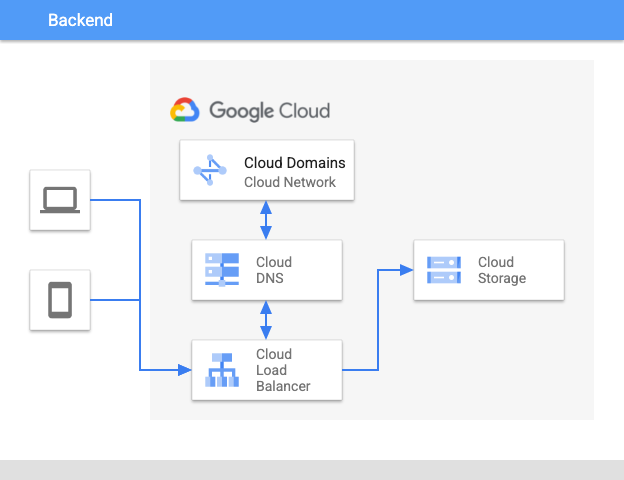

# App in a Box - YesOrNoSite 

This is a simple site creator that will spin up a Cloud Storage Served static
website, fronted by a Google Cloud Load Balancer with an SSL certificate. 



## Install
You can install this application using the `Open in Google Cloud Shell` button 
below. 

<a href="https://ssh.cloud.google.com/cloudshell/editor?cloudshell_git_repo=https%3A%2F%2Fgithub.com%2FGoogleCloudPlatform%2Fappinabox_yesornosite&cloudshell_print=install.txt&shellonly=true">
        </a>

Once this opens up, you can install by: 
1. Creating a Google Cloud Project
1. Then typing `./install`

## Cleanup 
To remove all Google Cloud billing components from the project
1. Typing `./uninstall`

**NOTE:** This will only clean up the infrastructure;  buying a domain is permanent
and non-reversable. 

## Testing
If you want to modify the script and test you have to jump through a few hoops. 
Also, the script can work against domains you've already purchased with Cloud
Domains. So do that first - then setup testing. 

1. Create a dedicated Google Cloud Project for Domain
1. Obtain domain with Cloud Domains
1. Verify the domain with using [Google Webmaster Central](https://www.google.com/webmasters/verification/home)
1. Add your Cloud Build Service Account as an owner of that account. 
1. Set an environmental variable `$APPINABOX_YESORNOSITE_DOMAIN` to be the domain you reserved.

* Run in bash:
```bash
./test
```
* Run in Cloud Build
```bash
gcloud builds submit --substitutions=_APPINABOX_YESORNOSITE_DOMAIN=$APPINABOX_YESORNOSITE_DOMAIN --config=test.yaml .
```

This is not an official Google product.